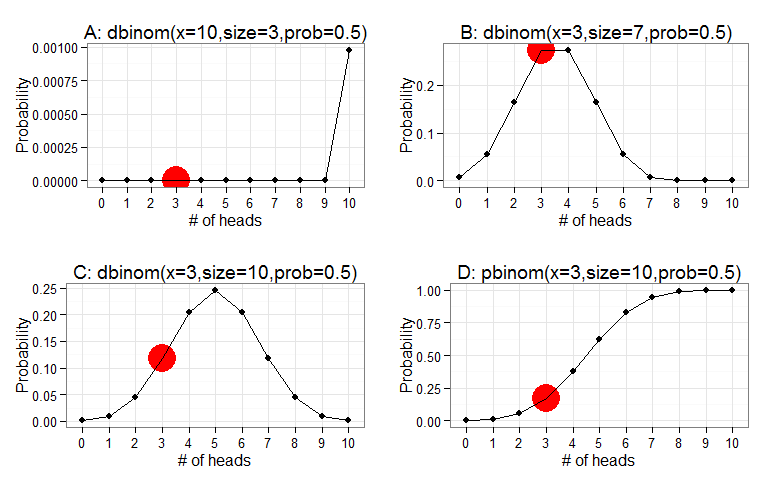

# Probability in R
Ben Weinstein  
Wednesday, March 11, 2015  

#Formative

###Which probability distribution should we use to model coin flips given a finite number of trials?

* Binomial 
* Negative Binomial 
* Normal 
* Poisson 

#Summative
###What is the probability of getting three heads in ten coin flips?

 

#Explanation and distractors

A. The size of the draw and number of successes are reversed. Good conceptual test - since it is nonsensical to draw 10 heads from 3 flips.

B. The total number of flips is 10 not 7, students selecting this option see the binomial trial as successes and failures, so 10-3=7. It has a reasonable shape, but the probability is too high.

C. Correct answer, the probability of getting three heads in 10 draws is around 0.11

D. The student has confused with the probability of a point estimate (3 heads) denoted by the dbinom density function with the probability of getting 3 or less heads, which is the cumulative distribution function pbinom. While the estimate is not that far off, the increasing function towards ten should seem wrong.

